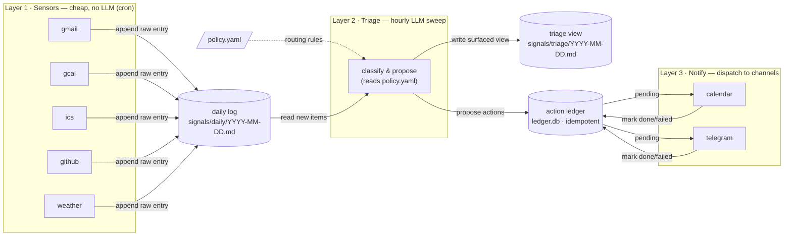

# signal-triage-notify

A three-layer situational-awareness system for [Hermes Agent](https://hermes-agent.nousresearch.com/): cheap no-LLM sensors collect raw signals (email, calendar, GitHub, weather, …), an hourly LLM triage pass classifies what's new, and a notify layer dispatches the handful of things that actually deserve a calendar entry or an interrupt.

Packaged as a Hermes **tap** — a `SKILL.md`-leaf-dir repo, installable in one command, following the [agentskills.io](https://agentskills.io) open standard.



> Node labels are tool-agnostic. `signals/daily/…` and `signals/triage/…` are **relative to the resolved `signals_dir`** (XDG default `~/.local/share/signal-triage/signals/` on Linux, or an Obsidian vault if you configure one) — not a required vault path.

## Why

Most "AI assistant reads my inbox" setups either interrupt you constantly or need an LLM call per item (slow, expensive, and re-judges the same email every poll). This system separates cheap collection from judgment: Layer 1 sensors are plain scripts that run every few minutes for ~0 tokens; Layer 2 spends LLM reasoning once per hour on only the genuinely new items; Layer 3 is the only layer allowed to interrupt you or touch your calendar, and it never sends calendar invites to third parties.

## Works with zero config

No Obsidian vault is required. This tool writes plain markdown to disk plus a small SQLite ledger; a "vault" is just a folder of `.md` files. On first run it resolves a sensible OS-correct location — `~/.local/share/signal-triage/` and friends on Linux (XDG), `~/Library/Application Support/signal-triage/` on macOS, `%LOCALAPPDATA%\signal-triage\` on Windows — creates the directories, and seeds a default `policy.yaml`. If you *do* use Obsidian, Logseq, or a Syncthing-synced folder, point it there with one config key: `signals_dir: ~/YourVault/signals`.

## Quickstart

```bash
hermes skills install <owner>/signal-triage-notify/signal-triage
hermes skills install <owner>/signal-triage-notify/signal-notify

# One-time bootstrap: builds the sensor venv, seeds policy.yaml, registers
# `hermes cron` jobs (sensors enabled; triage/notify created disabled so you
# can review output first).
${HERMES_SKILL_DIR}/scripts/setup.sh
```

> Verify the exact `hermes skills install` / tap-add subcommands against your installed Hermes CLI version — see `docs/writing-a-sensor.md#cli-verification`. The tap layout and `${HERMES_SKILL_DIR}` convention are confirmed by official Hermes docs; the precise install-verb spelling can drift between CLI releases.

After `setup.sh` finishes, it prints the OAuth (Gmail) and `gh` CLI credential steps for the sensors you want to enable. Enable `signal-triage` and `signal-notify` with `hermes cron resume <name>` once you've watched a few hours of raw signal output.

## What's in this repo

| Path | Purpose |
|---|---|
| `skills/signal-triage/SKILL.md` | Layer 2 — hourly classify & propose. |
| `skills/signal-notify/SKILL.md` | Layer 3 — dispatch pending actions. Bundles the whole sensor framework under `scripts/`. |
| `skills/signal-notify/scripts/` | `_sensorlib.py` (path resolution + log format), `registry.yaml` + `setup.py`/`setup.sh` (bootstrap), `signal_ledger.py`, `gcal_write.py`, `bootstrap_oauth.py`, and the example sensors (`gmail`, `github`, `weather`, `ics`). |
| `docs/architecture.md` | Full three-layer design + signal-lifecycle sequence diagram. |
| `docs/writing-a-sensor.md` | The sensor contract — how to add your own. |
| `.well-known/skills/index.json` | Tap discovery manifest. |

## Included example sensors

- **gmail** — Gmail history-delta poll (read-only OAuth token).
- **github** — review requests + unread notifications via the `gh` CLI.
- **weather** — one daily context line from Open-Meteo (no auth).
- **ics** — any public/secret `.ics` calendar feed (Outlook, Google "secret address", Fastmail, …).

Writing your own sensor for a source not listed here is straightforward — see `docs/writing-a-sensor.md`.

## OAuth / credential setup

- Gmail: create a Desktop OAuth client in Google Cloud Console, enable the Gmail API, then run `bootstrap_oauth.py` on a machine with a browser (not your server) and copy the resulting `token.json` into the resolved state directory. `setup.sh` prints the exact path.
- GitHub: requires `gh auth login` already done.
- Calendar writes: `gcal_write.py` needs a full-scope Google token — see `docs/writing-a-sensor.md`.

## License

MIT — see `LICENSE`.
