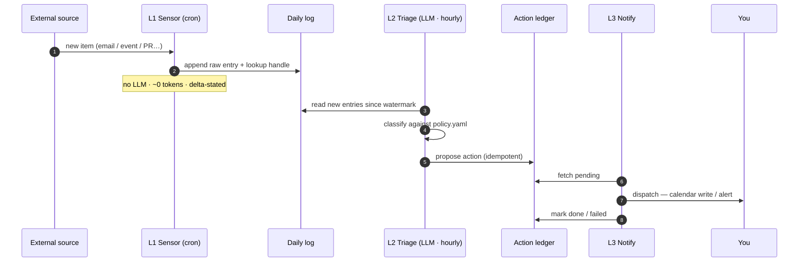

# Architecture

Three layers, cheapest first:

- **Layer 1 — Sensors.** Deterministic, no-LLM cron scripts. Each polls one
  source and appends compact entries to the daily signal log. They never
  alert; they only write.
- **Layer 2 — Triage.** An hourly LLM sweep (the `signal-triage` skill) reads
  new raw entries, classifies each into `URGENT / EVENT / ACTION / WATCH /
  FYI / NOISE`, writes a human-readable triage view, and proposes actions
  into an idempotency ledger. It never notifies or writes the calendar.
- **Layer 3 — Notify.** The `signal-notify` skill reads pending ledger
  actions and dispatches them: attendee-free calendar events, and alerts on
  the configured channel for URGENT items. It marks each action done/failed
  and is the only layer allowed to interrupt you.

## Signal lifecycle

## Idempotency

Every action is keyed by `(source_id, kind)` in `signal_ledger.py`'s SQLite
table. Triage never re-proposes an item once a row exists for it (checked via
`seen`); notify never re-dispatches a `proposed` row once it's been marked
`done`/`failed`. This makes every step of the pipeline safe to re-run,
retry, or overlap.

## Path resolution

See `_sensorlib.resolve_paths()` for the config → env → `platformdirs`
precedence that decides where the daily log, triage view, ledger, and policy
file live. No Obsidian vault or manual configuration is required — see the
README's "Works with zero config" section.

## Extending

New channels are just new `kind`s handled in `signal-notify`'s dispatch loop.
New sources are new sensors — see `writing-a-sensor.md`.
