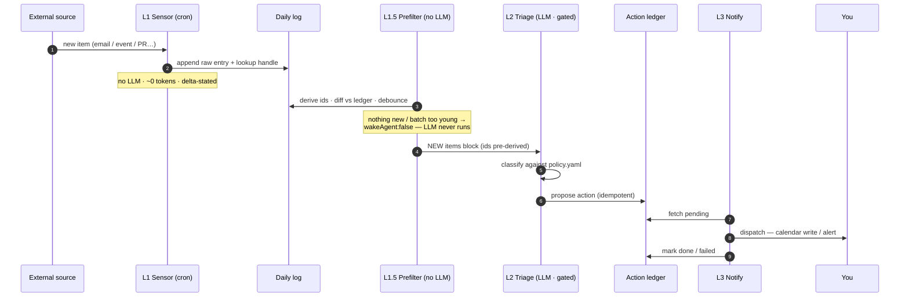

# Architecture

Three layers, cheapest first:

- **Layer 1 — Sensors.** Deterministic, no-LLM cron scripts. Each polls one
  source and appends compact entries to the daily signal log. They never
  alert; they only write.
- **Layer 1.5 — Prefilters / wake gates.** Deterministic pre-run scripts
  attached to the LLM jobs. `triage_prefilter.py` derives stable source ids,
  bulk-diffs against the ledger, debounces young batches, and hands the LLM
  only the genuinely new items; `notify_prefilter.py` settles bookkeeping
  rows itself and wakes the LLM only for actionable ones. When there is
  nothing to do, the last stdout line `{"wakeAgent": false}` makes the
  scheduler skip the agent run entirely.
- **Layer 2 — Triage.** A gated LLM sweep (the `signal-triage` skill)
  classifies each new item into `URGENT / EVENT / ACTION / WATCH / FYI /
  NOISE`, writes a human-readable triage view, and proposes actions into an
  idempotency ledger. It never notifies or writes the calendar.
- **Layer 3 — Notify.** The `signal-notify` skill reads pending ledger
  actions and dispatches them: attendee-free calendar events, and alerts on
  the configured channel for URGENT items. It marks each action done/failed
  and is the only layer allowed to interrupt you.

## Signal lifecycle

## Idempotency

Every action is keyed by `(source_id, kind)` in `signal_ledger.py`'s SQLite
table. Triage never re-proposes an item once a row exists for it (checked via
`seen`); notify never re-dispatches a `proposed` row once it's been marked
`done`/`failed`. This makes every step of the pipeline safe to re-run,
retry, or overlap.

## Wake gates & the prefilter layer

Scheduled LLM jobs carry a `script` hook whose stdout is injected at the top
of the agent prompt; if the last non-empty stdout line is
`{"wakeAgent": false}` the Hermes scheduler skips the run entirely. Two
consequences shape the design:

1. **Poll fast, flush slow.** Empty polls are free, so triage polls every
   15 minutes and batches with a content-blind age debounce
   (`triage.debounce_minutes` in policy.yaml): the LLM wakes when the oldest
   unjudged item has waited long enough, judging whole bursts in one run.
   Ages come from each entry's own `detected_at` stamp — no state file.
2. **Gates may do deterministic work.** `notify_prefilter.py` settles
   `kind=none` bookkeeping rows directly in SQLite (same write format as
   `signal_ledger.py mark`) instead of waking a model for mechanical
   updates.

Both prefilters fail open: any error prints a diagnostic and wakes the
agent, which falls back to the manual skill procedure. The prefilter is a
discovery optimization — the agent's final ledger `seen` guard remains the
idempotency authority. On runtimes without the wakeAgent convention the
system degrades gracefully: the agent wakes, reads the holding notice, and
exits in one cheap call.

## Path resolution

See `_sensorlib.resolve_paths()` for the config → env → `platformdirs`
precedence that decides where the daily log, triage view, ledger, and policy
file live. No Obsidian vault or manual configuration is required — see the
README's "Works with zero config" section.

## Extending

New channels are just new `kind`s handled in `signal-notify`'s dispatch loop.
New sources are new sensors — see `writing-a-sensor.md`.
